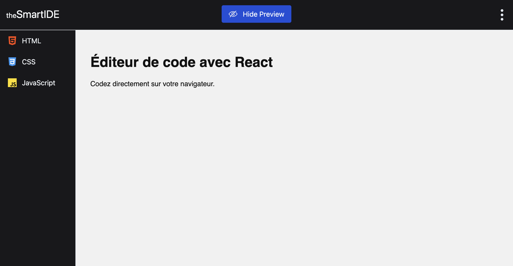

# 💻 IDE

A browser-based code editor with live preview built using React and Redux.  
This project was developed during the web development training at [École du Web](https://www.ecole-du-web.net/).

## 📖 Description

**theSmartIDE** is a minimalist online code editor that allows users to write HTML, CSS, and JavaScript and instantly preview the result in real-time. The interface is designed with simplicity and performance in mind, using React components and Redux for state management.

## 🚀 Features

- 📝 Write and edit HTML, CSS, and JavaScript in dedicated tabs.
- 👁️ Live preview of the result in an iframe.
- 🔄 Toggle preview visibility at any time.
- 💡 Simple and responsive layout using Tailwind CSS.
- 🧠 State management with Redux Toolkit.

## 🛠️ Tech Stack

- **React** with functional components & hooks
- **Redux Toolkit** for state management
- **Vite** for fast development and build
- **Tailwind CSS** for styling
- **ESLint** for linting

## 📦 Installation

```bash
git clone https://github.com/your-username/PP-IDE--react.git
cd PP-IDE--react
npm install
```

### ▶️ Usage

Start the app in development mode:

```bash
npm run dev
```

To build the app for production:

```bash
npm run dev
```

To preview the production build:

```bash
npm run preview
```

## 🧠 What I learned

- Managing multi-tab code inputs with Redux state.
- Creating a dynamic and interactive UI using React components.
- Updating live previews using the iframe srcDoc attribute.
- Integrating Tailwind CSS for rapid and consistent design.
- Organizing logic into reusable components and Redux slices.

## 🖼️ Screenshots


